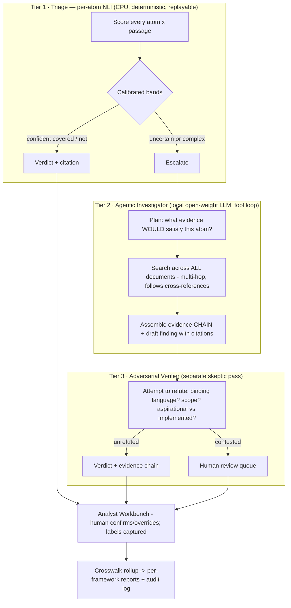

# Production Scope v2 — Compliance Intelligence Platform (India)

**Author framing:** Senior AI architect assessment (ML systems + data engineering + security/GRC + product + go-to-market).
**v2 changes:** corrected competitive landscape (AI-GRC is crowded globally — the "nobody reads documents" premise is dead), repositioned wedge to the **Indian regulatory market**, replaced the static RAG pipeline with a **three-tier agentic cascade**, added MCP surface.
**Honest premise unchanged:** the ML core is the smallest piece; the product is the surrounding 90% — plus, in v2, the *content* (Indian framework atom libraries) is recognised as a first-class asset, not an input file.

---

## 0. Product Thesis (one paragraph)

> Indian regulated entities — banks, NBFCs, fintechs, brokers, insurers, health-tech — face **overlapping mandates**: RBI Master Directions, SEBI CSCRF, CERT-In directions, DPDP Act, IRDAI guidelines, plus ISO 27001 for their customers. Proving that their written policies and procedures satisfy each framework is manual, consultancy-driven, spreadsheet-based work, repeated for every framework and every audit cycle. **We read the organisation's actual policy and procedure documents, map them to each applicable Indian framework at the level of individual obligations, cite the exact evidence or gap for every requirement, assess once and report across all applicable frameworks via crosswalk — and run entirely within the customer's infrastructure or in-India hosting, satisfying data-residency requirements by construction.**

**Positioning:** *"Analyst-assist, not auditor-replacement."* Sell "cut your gap-assessment time 60% with cited evidence for every obligation," never "automated compliance" (liability trap, §8).

---

## 1. Why India, Why Now

| Catalyst | What it means |
|---|---|
| **DPDP Act enforcement ramp** (Rules notified; penalties up to ₹250 crore) | Every Significant Data Fiduciary needs DPIAs, audits, documented safeguards. A one-time compliance wave across the entire economy — the single biggest demand event. |
| **SEBI CSCRF** (2024, phased deadlines) | Brokers, MFs, MIIs must demonstrate cyber-resilience compliance with evidence. Mid-size brokers have no tooling. |
| **RBI enforcement posture** | Master Direction on IT Governance (2024), cyber framework, outsourcing directions — RBI is actively penalising banks/NBFCs for IT-governance gaps. Thousands of NBFCs and cooperative banks with near-zero compliance staff. |
| **CERT-In directions** | 6-hour incident reporting, 180-day log retention — incident-record compliance mapping (your PhD pipeline) applies directly. |
| **Data residency / localisation** | RBI payment-data localisation; DPDP transfer restrictions; government buyers require in-India processing. **Cloud-API-wrapper competitors are structurally disadvantaged — our on-prem/local-inference design is the fit.** |
| **The overlap pain** | A fintech NBFC needs RBI + CERT-In + DPDP + ISO 27001 *simultaneously*. Overlapping obligations, separately audited. Nobody wants four manual gap assessments. **Crosswalk — assess once, report per framework — is worth more in India than anywhere.** |

> ⚠️ Before any pitch: re-verify DPDP Rules status/dates, SEBI CSCRF deadlines, and competitor claims — these move quarterly.

---

## 2. Competitive Landscape (corrected, v2)

### Global AI-GRC — crowded; do not fight here
| Player | Reality |
|---|---|
| Vanta AI / Drata / Secureframe | Now do LLM policy gap-analysis and doc-to-control suggestions — cloud-only, SOC2/ISO-centric |
| Norm Ai (heavily funded) | Regulatory AI agents; closest to per-atom idea, venture scale, US regulations |
| 4CRisk.ai | AI policy-vs-regulation gap analysis — near-identical concept, international focus |
| IBM OpenPages + watsonx, ServiceNow | Enterprise AI-GRC, heavy, expensive |

### India-specific — the actual terrain
| Player | What they do | Gap we exploit |
|---|---|---|
| **Sprinto, Scrut** (Indian-built, well-funded) | Vanta-style automation for Indian SaaS **selling abroad** — SOC 2 / ISO 27001 DNA, cloud-integration checks | Domestic frameworks (RBI/SEBI/DPDP/CERT-In) are not their core; document-semantic gap analysis is not their method; cloud-native, not on-prem |
| **Simpliance, TeamLease RegTech, Complinity, Lexplosion** | Statutory **obligation trackers** — compliance calendars, filings, registers | Checklist tracking, not semantic analysis of policy documents. Different product; possible channel partners |
| **VComply** and GRC workflow tools | Workflow/risk registers | No document intelligence |
| **Big-4 India + CA/CS/cyber consultancies** | Manual gap assessments (₹5–50L engagements) | Our channel, not our competitor — the force-multiplier play |
| **DPDP consent-manager startups** (IDfy, Leegality, etc.) | Consent infrastructure | Adjacent, not overlapping — integration partners |

**The seam:** India has strong *obligation-trackers* and strong *international-framework automation*, but almost nothing doing **semantic policy-document → domestic-framework gap analysis with evidence**. That work is done today by consultants, by hand.

---

## 3. The Wedge (v2 — three durable differentiators)

1. **Indian regulatory atom library + crosswalk.** RBI Master Directions, SEBI CSCRF, DPDP, CERT-In, IRDAI, decomposed to atomic obligations, versioned, SME-validated, crosswalked to ISO 27001. This is *content*, maintained as regulations change — slow to build, painful to copy, and the incumbents' backlog puts it years away for them. **The library is the moat more than the model.**
2. **Data-sovereign deployment.** Local CPU/GPU inference (NLI + open-weight LLM), air-gapped installable, or in-India hosting. Satisfies RBI localisation, DPDP transfers, and government procurement by construction. API-wrapper competitors cannot follow without re-architecting.
3. **Audit-grade evidence chains.** Per-atom verdicts with citations, calibrated confidence, abstention to human review, hash-chained audit log. Incumbents output plausible LLM prose; auditors and regulators need traceable evidence. Surface this as the product, not plumbing.

---

## 4. Target Architecture v2 — The Agentic Cascade

The v1 static pipeline (retrieve → NLI → aggregate) is demoted, not deleted: it becomes Tier 1 of a cascade. Rationale: single-passage entailment misses **distributed evidence** (policy states intent, procedure implements, annexure defines scope) — the main source of FA/PA errors — while remaining the cheap, deterministic, auditable triage layer that makes on-prem viable.

Design rules:
- **Tier 1 stays deterministic** — bit-for-bit replayable verdicts for the easy ~60–70%; this is the audit story and the CPU-only on-prem story.
- **Tier 2 runs on local open-weight models** (Qwen/Llama-class on one mid GPU) — agentic *and* sovereign. On CPU-only installs, Tier 2 degrades to "route to human," which is still correct product behaviour.
- **Tier 3 replaces naive thresholding** as the quality gate; contested findings *are* the abstention band.
- **Everything logs**: prompts, tool calls, retrieved passages, chains. "Agentic" and "auditable" coexist because no conclusion exists without a citation chain.
- **MCP surface:** the engine is also exposed as an MCP server (`assess_document`, `check_control`, `explain_gap`, `export_evidence`) so enterprise agent ecosystems (Copilot/Claude/ServiceNow deployments) can call compliance as a tool. Distribution channel + direct tie to the PhD's MCP-security work.

---

## 5. Module Breakdown (v2 deltas from v1)

P0 = design-partner MVP · P1 = sellable product · P2 = platform.

| # | Module | v2 state & target | Key delta from v1 |
|---|---|---|---|
| 1 | **Ingestion** | DOCX/PDF/OCR → passages with provenance; parse-quality gate | Unchanged; add scanned-PDF OCR earlier (Indian orgs scan everything) |
| 2 | **Framework Library** | **RBI Master Direction (IT Gov + cyber) as P0 framework**; then DPDP, SEBI CSCRF, CERT-In, ISO 27001 crosswalk (P1) | Was HIPAA-first; now Indian frameworks. Treat as versioned content ops with SME validation; bootstrap structure from OSCAL patterns; regulations are public and in English |
| 3 | **Retrieval** | Hybrid BM25 + dense (pgvector); recall-first | Unchanged; also serves Tier 2's search tools |
| 4 | **Compliance Cascade (ML core)** | Tier 1 NLI triage (exists, F1=0.53 → calibrate + band) · Tier 2 agentic investigator (new) · Tier 3 adversarial verifier (new) | **Biggest v2 change** — replaces "single judge + abstention" with the cascade; evidence chains become the verdict format |
| 5 | **Analyst Workbench** | Queue by confidence/contested; atom ↔ evidence-chain view; confirm/override; labels captured | Unchanged in role — still the primary product surface; now renders chains, not single passages |
| 6 | **Reporting** | Per-framework rollup via crosswalk; auditor-ready PDF/XLSX with citations; "reviewed-by" stamp | Crosswalk-aware ("assess once, report per framework") |
| 7 | **Trust & Audit** | Hash-chained append-only log; full agent-trace retention; provenance view | Extended to log Tier 2/3 traces |
| 8 | **Platform** | Single-tenant per-deployment (P0) → multi-tenant in-India SaaS (P1); compose-stack install | Add optional GPU container (Ollama/vLLM) for Tier 2 |
| 9 | **MLOps & Eval** | Expert multi-annotator eval set per framework; eval-in-CI; active learning from workbench labels | Unchanged; the current circular v2-key must be replaced by an independent expert set — this doubles as the PhD benchmark |
| 10 | **MCP Surface** *(new)* | Engine tools over MCP; authn/authz on the tool boundary | New module; small (P1); PhD synergy |

Stack (unchanged from the build guide, boring on purpose): FastAPI + Postgres(+pgvector) monolith, Postgres-backed job worker, React/Vite workbench, Docker Compose = the on-prem artifact. Tier 2 adds one optional GPU container.

---

## 6. Go-To-Market (India)

- **Channel first, not direct:** compliance consultancies, CA/CS firms, ISO auditors, vCISO shops. They do today's manual mapping; the tool multiplies their engagement margin. They bring documents, domain review, and distribution; you get expert labels and references. **Design partner = one mid-size cyber/GRC consultancy in Bengaluru/Mumbai.**
- **Beachhead segment:** BFSI mid-market — NBFCs, fintechs, brokers, cooperative banks (regulator-pushed, understaffed, numerous). Health-tech under DPDP/ABDM as the PhD-aligned second segment.
- **Pricing reality:** India will not pay Vanta prices. Think per-engagement licensing to consultancies (₹ tens of thousands per assessment) and annual SaaS in low ₹ lakhs for direct mid-market — volume economics, low-touch onboarding.
- **DPDP timing:** the enforcement wave is the marketing calendar. A "DPDP readiness gap report on your actual policies" is the wedge offer that opens doors; RBI/SEBI depth is what retains.

---

## 7. Phased Roadmap (v2)

**Phase 0 — Design-partner MVP (≈ 3–4 months, part-time realistic)**
RBI IT-Governance framework atomised + SME-validated · ingestion hardened (incl. scanned PDFs) · Tier 1 calibrated with bands · minimal Tier 2 investigator (single-agent loop, local model) · workbench (queue → chain view → confirm/override) · PDF report + hash-chained log · independent expert eval set (κ reported) · one consultancy design partner running a real engagement.
*Exit:* partner confirms meaningful time savings; ≥0.80 F1-with-abstention on the expert set.

**Phase 1 — Sellable product (6–9 months after P0)**
DPDP + SEBI CSCRF + CERT-In frameworks + ISO crosswalk · Tier 3 verifier · full workbench + remediation · multi-tenant in-India hosting + SSO/RBAC · MCP surface · active-learning loop · begin SOC 2/ISO for ourselves.
*Exit:* 3–5 paying consultancies/customers; onboarding without founder hand-holding.

**Phase 2 — Platform (12+ months)**
Regulation-change monitoring feeding library updates · auditor portal · connectors · drift-triggered retraining · GA across on-prem / in-India SaaS.

---

## 8. Risk Register (v2)

| Risk | Severity | Mitigation |
|---|---|---|
| Accuracy → liability ("you said compliant, RBI fined us") | Critical | Analyst-assist positioning; abstention; human sign-off on every report; contractual decision-support carve-out |
| **Sprinto/Scrut add domestic-framework document analysis** | High | Move fast on library depth + consultancy lock-in; on-prem remains structurally hard for them |
| DPDP enforcement slips (Indian regulatory timelines do) | High | RBI/SEBI demand is already live and enforcement-backed — don't bet the company on DPDP alone |
| Framework library OpEx (regulations change constantly) | High | Content-ops process with SME budget; regulation-change monitoring in P2; consultancy partners co-maintain |
| India price sensitivity → unit economics | Medium | Channel model (consultancy licensing); low-touch onboarding; CPU-tier keeps serving cost near zero |
| Tier 2 agent quality on local models | Medium | Cascade degrades gracefully (route to human); cloud-LLM tier optional for non-sovereign customers |
| Platform build dwarfs ML work | Medium | Single-tenant-per-deployment in P0 defers multi-tenancy; boring stack |
| PhD (HIPAA/IoMT) vs product (India BFSI) domain divergence | Medium | Methodology, cascade, benchmark, and MCP-security work are shared; only framework *content* differs — accept the split consciously |

---

## 9. What Carries Over (nothing wasted)

| Asset | Where it lands |
|---|---|
| Per-atom decomposition + build_atom_dataset | Module 2 method; applied to RBI/DPDP/SEBI text |
| NLI judge + calibration | Tier 1, as-is |
| Llama per-atom fine-tune | Tier 1 alternative / Tier 2 base-model candidate |
| Pooled annotation + grade_judge + κ harness | Module 9 eval kit (CI) |
| Rollup/reconcile/adjudicate scripts | Modules 5–6 seeds |
| Under-labelling finding | Eval-methodology rationale + paper section |
| UAE IA / ADHICS content | Shelved, optional Gulf export later — the *method* that built them is the asset |

---

## 10. Build Order (one sentence, v2)

**Calibrated Tier 1 + RBI atom library + minimal agentic investigator + workbench with evidence chains + one Indian consultancy design partner — then Tier 3, more frameworks, crosswalk, multi-tenancy, MCP, scale.**

Do not build the platform until a consultancy is asking to pay. The PhD supplies the validated method and honest benchmark; the design partner supplies demand, documents, and expert labels. Same de-risking loop as v1 — now aimed at a market you're actually in.
